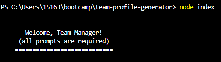
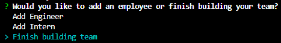
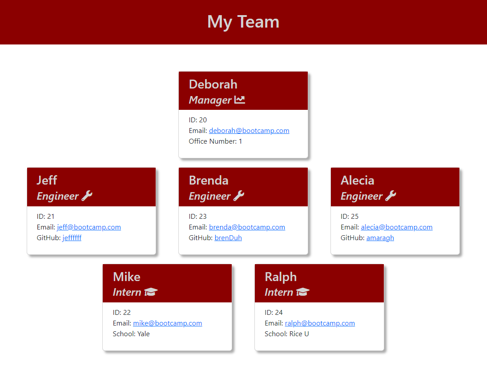

# Team Profile Generator

## Description

Using `inquirer` and `jest`, I was able to create a Node.js command line application to collect team member information and then generate a simple HTML page based on the information entered.

This was a challenging exercise in writing and passing tests, creating conditional prompts using inquirer and leveraging prompts responses with ES6 classes to conditionally generate dynamic HTML.

## Installation

Clone the repo, then from the command line, run `npm install` in the project's root directory to download any dependencies.

## Usage

The demo recording can be found [here](https://youtu.be/1EZn5_iB2Ps).

Navigate to project root directory and run the command `node index` to invoke the application. The application allows entry of one team manager and multiple engineers and interns. 

The below is seen once the application is invoked. 

Once the manager prompts have been answered, the below prompt will appear. After an Engineer or Intern icreated, the prompt will appear again until the user selects 'Finish building team', at which point, the application will exit, and the HTML page will be generated in the `/dist` folder.

A sample of a generated team page is shown below. Clicking on an email address will take to you a draft email to that email address in your machine's native email application. Clicking on the GitHub username will take you to the engineer's GitHub profile in a new tab.

## License

Please see repo for license information.

## Tests

Run `npm run test` in project's root directory.